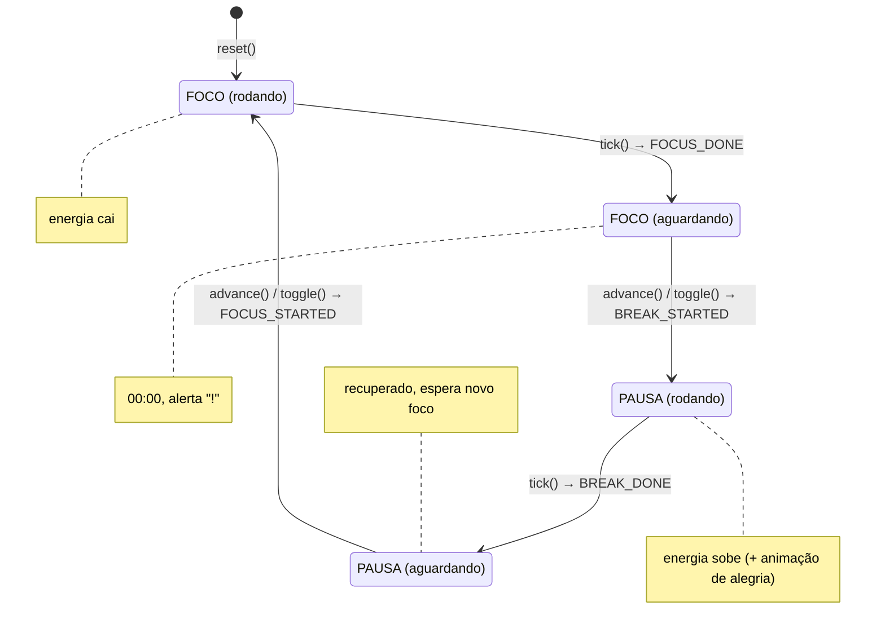

# Pomodoro Pet

[](https://opensource.org/licenses/MIT)

Timer Pomodoro em Python + Pygame com um monstrengo fofo que **cansa enquanto você trabalha** e **se recupera nas pausas**. Quanto mais cansado, mais ele **vira um demoniozinho**: a cor, os chifres, os olhos e a boca vão mudando de fofos para demoníacos — um Tamagotchi de produtividade em pixel art.

O diferencial é que a troca de fase é **manual**: ao terminar o foco, o monstrengo fica *aguardando* você marcar o início da pausa. É nesse momento que entra a animação de alegria — recompensa visual por respeitar o descanso.

---

## Demonstração

| Foco | Fim do foco | Pausa |
|:---:|:---:|:---:|
|  |  |  |
| Começa **fofo e concentrado** (energia 85%) | **Cansa e demoniza** no fim do foco; o botão vira *começar pausa* | Na **pausa**, descansa e volta a ficar **feliz** |

---

## Modo overlay (usar enquanto trabalha)

A janela é feita para ficar discretamente na tela sem atrapalhar o trabalho. Ela tem **fundo 100% transparente** (por cor-chave, no Windows) e dois estados:

- **Repouso (compacto):** só o monstrengo e o timer flutuando, com opacidade baixa (`ALPHA_IDLE`).
- **Expandido (mouse em cima):** a opacidade sobe e surge um painel com rótulo de fase, energia, ciclos e **botões** (iniciar/pausar, pular, reset, sair).

A transição é suave (`REVEAL_SPEED`) e disparada por `pygame.mouse.get_focused()` — basta o cursor entrar na janela. Para a transparência, a janela vira uma *layered window* do Windows (`WS_EX_LAYERED` + `SetLayeredWindowAttributes` com `LWA_COLORKEY | LWA_ALPHA`): tudo que é pintado com a cor-chave `MAGIC` fica invisível e o restante recebe a opacidade atual.

> Transparência é **Windows-only**. Em outros sistemas, ou rodando com `--opaque`, a janela abre opaca normalmente (o resto continua igual).

---

## Índice

- [Demonstração](#demonstração)
- [Modo overlay](#modo-overlay)
- [Como funciona](#como-funciona)
  - [Ciclo de fases](#ciclo-de-fases)
  - [Diagrama de estados](#diagrama-de-estados)
  - [Modelo de energia](#modelo-de-energia)
  - [Humor e expressões](#humor-e-expressões)
  - [Animações](#animações)
- [Arquitetura](#arquitetura)
  - [Módulos](#módulos)
  - [API de `pet.py`](#api-de-petpy)
  - [Camada de renderização](#camada-de-renderização)
- [Instalação e execução](#instalação-e-execução)
- [Controles](#controles)
- [Parâmetros de ajuste](#parâmetros-de-ajuste)
- [Estrutura do projeto](#estrutura-do-projeto)
- [Testes](#testes)
- [Decisões de projeto](#decisões-de-projeto)
- [Possíveis extensões](#possíveis-extensões)

---

## Como funciona

### O personagem

O monstrengo é **pixel art desenhada em tempo real**, sem sprites externos: ele é renderizado numa superfície lógica de `64×64` (`SPRITE`) e ampliado `2×` com *nearest-neighbor* (`SCALE`), o que dá o aspecto de pixels grandes.

O que define a "demonização" é a propriedade `_menace()` (0 = fofinho, 1 = demônio). Ela cresce conforme a energia cai e interpola, em tempo real, os traços do monstrengo:

| `_menace()` | Traço |
|-------------|-------|
| 0 → 1 | cor do corpo (verde-menta → vermelho) |
| 0 → 1 | comprimento e curva dos chifres |
| 0 → 1 | olhos (arredondados → amendoados com pupila em fenda e sobrancelha raivosa) |
| 0 → 1 | boca (sorriso com dentinho → grin aberto com várias presas) |
| 0 → 1 | cauda pontuda (nasce por volta de 0,2) |

### Ciclo de fases

O app alterna entre duas fases — **FOCO** e **PAUSA** — mas a transição nunca é automática. Quando o tempo de uma fase chega a zero, o bichinho entra no estado **aguardando** (`awaiting`) e espera uma ação do usuário para iniciar a próxima fase.

```
FOCO --(tempo acaba)--> aguardando --(usuário marca a pausa)--> PAUSA (comemora)
  ^                                                                  |
  +--------------- aguardando <--(tempo acaba)-----------------------+
```

| Fase | Duração padrão | Energia | Aparência |
|------|----------------|---------|-----------|
| FOCO | 25 min | cai | começa concentrado e vai ficando cansado |
| PAUSA | 5 min | sobe | cansado, dorme e acorda recuperado |

A cada FOCO concluído, um **ciclo** é contabilizado (exibido como bolinhas verdes).

### Diagrama de estados

Estados definidos por `phase` (`FOCUS`/`BREAK`), `running` (rodando/pausado) e `awaiting` (aguardando ação):



Regras:

- `running=True` e `awaiting=False` → a fase está contando o tempo.
- `awaiting=True` → o tempo acabou; `running` é forçado a `False` e `remaining` vai a `0`.
- `tick()` **nunca** troca de fase sozinho — ele só sinaliza o fim com um evento.
- `skip()` (tecla `S`) encerra a fase imediatamente, como se o tempo tivesse acabado.

### Modelo de energia

A energia é um número entre `0` e `100`, atualizado a cada frame pelo tempo decorrido (`dt`). As taxas são derivadas dos parâmetros de custo/recuperação, então a dinâmica independe da duração escolhida:

```
Durante FOCO:   E = clamp(E - focus_cost    / focus_duration * dt, 0, 100)
Durante PAUSA:  E = clamp(E + break_restore / break_duration * dt, 0, 100)
```

Com os valores padrão (`focus_cost = 45`, `break_restore = 45`), um ciclo completo devolve o bichinho ao ponto de partida:

```
E=85  --FOCO 25min-->  E=40 (cansado)  --PAUSA 5min-->  E=85 (recuperado)
```

Ou seja: o bichinho cansa visivelmente durante o trabalho e recupera totalmente no descanso. Ajustando `break_restore < focus_cost`, o cansaço **acumula** ao longo do dia.

### Humor e expressões

O humor é derivado da energia e da fase (propriedade `mood` em `pet.py`):

| Condição | Humor | Aparência |
|----------|-------|-----------|
| energia ≤ 20 | `exhausted` | vermelho demoníaco, chifres roxos, olhos virados, boca ofegante |
| energia ≤ 45 | `tired` | laranja, olhos semicerrados, gotas de suor, presas e cauda |
| fase = FOCO e energia > 45 | `focus` | fofo e concentrado: sobrancelhas determinadas, olhar fixo |
| energia ≤ 75 (na pausa) | `ok` | amarelado, sorriso discreto |
| energia > 75 (na pausa) | `happy` | verde-menta, olhos grandes, sorriso e bochechas |

A cor e os traços mudam de forma contínua com `_menace()` (ver [O personagem](#o-personagem)), então a transição fofo → demoníaco acontece aos poucos, não em saltos.

A camada de renderização acrescenta dois estados visuais:

- **`resting`** — durante a PAUSA, enquanto a energia ainda é baixa: olhos fechados e `zZz` subindo.
- **`happy`** — ao final da PAUSA, quando a energia recupera (≥ 70): o monstrengo "acorda" sorrindo.

Prioridade de expressão em `_expression()`: animação de alegria > pausa recuperando > humor normal.

### Animações

| Animação | Gatilho | Duração | Efeito |
|----------|---------|---------|--------|
| Alerta | fim de fase (`FOCUS_DONE`/`BREAK_DONE`) | 1,6 s | "!" pulsando + botão com brilho |
| Alegria | início da pausa (`BREAK_STARTED`) | 1,8 s | pulo, estrelas girando e anel de destaque |
| Respiro/hover | sempre | contínuo | corpo balança; no foco é mais rápido que no descanso |

---

## Arquitetura

O projeto separa **regra de negócio** de **apresentação**. `pet.py` não importa Pygame, o que permite testar toda a mecânica sem abrir janela.

### Módulos

| Arquivo | Responsabilidade |
|---------|------------------|
| `pet.py` | Lógica pura: máquina de estados, energia, humor e formatação de tempo. Sem dependências gráficas. |
| `pomodoro.py` | Renderização em pixel art, animações, entrada do usuário e o loop principal em Pygame. |
| `tests/` | Testes de lógica (`test_pet.py`) e de renderização headless (`test_pomodoro.py`). |

### API de `pet.py`

Constantes:

| Nome | Valor / significado |
|------|---------------------|
| `FOCUS`, `BREAK` | identificadores das fases |
| `PHASE_LABELS` | rótulos exibidos (`"FOCO"`, `"PAUSA"`) |
| `EXHAUSTED_MAX`, `TIRED_MAX`, `OK_MAX` | limiares de humor (20 / 45 / 75) |
| `FOCUS_DONE`, `BREAK_DONE` | eventos de fim de fase |
| `BREAK_STARTED`, `FOCUS_STARTED` | eventos de início de fase |

Construtor:

```python
PomodoroPet(
    focus_duration=25 * 60,   # segundos de foco
    break_duration=5 * 60,    # segundos de pausa
    start_energy=85.0,        # energia inicial
    focus_cost=45.0,          # energia perdida por fase de foco completa
    break_restore=45.0,       # energia recuperada por pausa completa
)
```

Métodos:

| Método | Efeito | Retorna |
|--------|--------|---------|
| `start()` | inicia a fase atual (se não estiver `awaiting`) | `None` |
| `pause()` | pausa a contagem | `None` |
| `toggle()` | pausa/retoma; se `awaiting`, inicia a próxima fase | evento ou `None` |
| `advance()` | inicia a próxima fase a partir de `awaiting` | `BREAK_STARTED` / `FOCUS_STARTED` / `None` |
| `skip()` | encerra a fase atual agora | `FOCUS_DONE` / `BREAK_DONE` |
| `reset()` | nova sessão (foco, energia inicial, ciclos zerados) | `None` |
| `tick(dt)` | avança `dt` segundos e atualiza a energia | lista de eventos |
| `format_time(seconds)` | formata segundos como `MM:SS` (estático) | `str` |

Propriedades:

| Propriedade | Descrição |
|-------------|-----------|
| `duration` | duração da fase atual |
| `next_phase` | próxima fase (`BREAK` se estiver no foco, senão `FOCUS`) |
| `progress` | fração decorrida da fase (`0.0`–`1.0`) |
| `mood` | humor derivado (`focus`/`happy`/`ok`/`tired`/`exhausted`) |
| `resting` | `True` durante a pausa em execução |
| `phase_label` | rótulo legível da fase (`"FOCO"`/`"PAUSA"`) |

Exemplo de uso sem interface:

```python
from pet import PomodoroPet, FOCUS_DONE

pet = PomodoroPet(focus_duration=100, break_duration=40)
pet.start()
pet.tick(100)          # -> ['focus_done']; bichinho cansado, aguardando
print(pet.mood)        # 'tired'
pet.advance()          # usuário marca a pausa -> 'break_started'
pet.tick(40)           # -> ['break_done']; recuperado
print(pet.mood)        # 'happy'
```

### Camada de renderização

`pomodoro.py` contém a classe `PetWindow` e um loop a `60 FPS`. Tudo é desenhado num canvas lógico de `240×168` e ampliado com nearest-neighbor para o tamanho real da janela (`--scale`, padrão 2×), preservando o visual pixel art em qualquer tamanho. Pontos principais:

- `_expression()` decide o que desenhar combinando alegria, recuperação e `mood`.
- `_menace()` mede o quanto o monstrengo "demonizou" (0 a 1) a partir da energia.
- `_sprite()` monta o monstrengo numa superfície `64×64`, que é ampliada com `pygame.transform.scale` (nearest-neighbor) para virar pixel art.
- `_sprite_horns()`, `_sprite_tail()`, `_sprite_arms()` e `_sprite_face()`/`_sprite_mouth()` desenham o corpo e a expressão interpolando os traços por `_menace()`.
- `_sprite_joy()`, `_sprite_sweat()` e `_sprite_zzz()` cuidam dos efeitos.
- `_WindowDrag` usa `ctypes` para arrastar a janela e mantê-la sempre no topo (somente Windows). Nos demais sistemas a janela é comum e redimensionável — arrastar e redimensionar ficam a cargo da moldura nativa, já que o Wayland não permite ao app mover a própria janela via código.
- `energy_color()` interpola uma paleta de quatro cores conforme a energia (vermelho demoníaco → laranja → amarelo → verde-menta).

Constantes de layout e estilo ficam no topo do módulo (`WIDTH`, `COMPACT_PET`, `EXPANDED_PET`, `BTN_*`, `ENERGY_STOPS`, `ALPHA_IDLE`, `JOY_TIME`, etc.), fáceis de ajustar.

---

## Instalação e execução

```bash
pip install -r requirements.txt
python pomodoro.py
```

Modo demo, com ciclos curtos (6 s de foco / 4 s de pausa) para ver o fluxo completo em segundos:

```bash
python pomodoro.py --demo
```

Em máquinas sem a transparência (ou para forçar a janela opaca), use `--opaque`:

```bash
python pomodoro.py --opaque
```

Para uma janela maior ou menor, ajuste a ampliação do canvas lógico (`240×168`) com `--scale` (padrão `2`):

```bash
python pomodoro.py --scale=3
```

Requisitos: Python 3.x e Pygame.

---

## Controles

| Ação | Entrada |
|------|---------|
| Revelar o painel | Passar o mouse sobre a janela |
| Botão de ação (iniciar / pausar / começar fase) | Botão principal (expandido), clique no monstrengo (repouso) ou `Espaço` / `Enter` |
| Pular fase | Botão `pular` ou `S` |
| Novo ciclo (reset) | Botão `reset`, clique direito ou `R` |
| Sair | Botão `sair` ou `Esc` |
| Mover a janela | Arrastar (fora dos botões); fora do Windows, arrastar pela barra de título |
| Sons | `--sound` (padrão: **mudo**) |

O botão principal muda de rótulo conforme o contexto: `iniciar foco`, `pausar`, `retomar` e `comecar pausa`. Os olhos do monstrengo acompanham o mouse.

---

## Parâmetros de ajuste

Todos em `pet.py` (mecânica) e `pomodoro.py` (visual):

| Parâmetro | Local | Padrão | Efeito |
|-----------|-------|--------|--------|
| `focus_duration` | `PomodoroPet` | `25*60` | duração do foco (s) |
| `break_duration` | `PomodoroPet` | `5*60` | duração da pausa (s) |
| `start_energy` | `PomodoroPet` | `85` | energia inicial |
| `focus_cost` | `PomodoroPet` | `45` | energia perdida por foco completo |
| `break_restore` | `PomodoroPet` | `45` | energia recuperada por pausa completa |
| `EXHAUSTED_MAX` / `TIRED_MAX` / `OK_MAX` | `pet.py` | `20` / `45` / `75` | limiares de humor |
| `SPRITE` / `SCALE` | `pomodoro.py` | `64` / `2` | resolução lógica e ampliação da pixel art |
| `ALPHA_IDLE` / `ALPHA_ACTIVE` | `pomodoro.py` | `120` / `240` | opacidade no repouso e no hover (0–255) |
| `REVEAL_SPEED` / `REVEAL_THRESHOLD` | `pomodoro.py` | `6.0` / `0.4` | velocidade e limiar da transição compacto ↔ expandido |
| `MAGIC` | `pomodoro.py` | `(255,0,255)` | cor-chave que vira transparente |
| `--sound` | `pomodoro.py` | desligado | liga os sons das transições de fase |
| `--scale` | CLI | `2` | ampliação nearest-neighbor do canvas lógico |
| `JOY_TIME` / `ALERT_TIME` | `pomodoro.py` | `1.8` / `1.6` | duração das animações (s) |
| `ENERGY_STOPS` | `pomodoro.py` | 4 cores | paleta da barra e do corpo |

---

## Estrutura do projeto

```
pomodoro-elen/
├── pet.py                     # lógica pura (sem Pygame)
├── pomodoro.py                # app Pygame (render + loop)
├── requirements.txt
├── Dockerfile                 # roda em container (X11) ou com ./run.sh --local
├── run.sh                     # script de execução (Docker ou nativo)
├── LICENSE                    # MIT
├── README.md
└── tests/
    ├── conftest.py            # adiciona a raiz ao sys.path
    ├── test_pet.py            # testes de lógica
    └── test_pomodoro.py       # testes de render headless
```

---

## Testes

```bash
pip install pytest
pytest tests/ -v
```

- `test_pet.py` cobre formatação de tempo, controles, máquina de estados (`awaiting`, `advance`), modelo de energia, humor e progresso. Não abre janela.
- `test_pomodoro.py` roda com o driver de vídeo `dummy` (`SDL_VIDEODRIVER=dummy`) para validar a renderização de cada humor, o rótulo do botão e a animação de alegria sem abrir janela.

---

## Decisões de projeto

- **Lógica separada da interface** (`pet.py` sem Pygame): permite testes rápidos e headless, além de facilitar trocar a camada gráfica.
- **Troca de fase manual**: transforma a pausa em um gesto consciente e cria o gancho para a animação de alegria, reforçando o propósito do Pomodoro.
- **Energia por custo de fase**: em vez de taxas fixas por segundo, os custos são definidos por fase completa, então mudar a duração não desbalanceia a mecânica.
- **Sem assets externos**: o monstrengo é pixel art gerada em código (superfície baixa + escala nearest-neighbor), sem depender de imagens.

---

## Possíveis extensões

- Sons ao fim de fase e na comemoração.
- Ciclos longos de descanso (a cada 4 focos, uma pausa maior).
- Persistência de energia/ciclos entre sessões.
- Personalização do bichinho (nome, cores, acessórios).
- Empacotamento como executável (PyInstaller).

---

## Licença

Este projeto está licenciado sob a [MIT License](LICENSE) — você pode usar, copiar, modificar, mesclar, publicar, distribuir, sublicenciar e/ou vender cópias do software, com a única exigência de manter o aviso de copyright.
